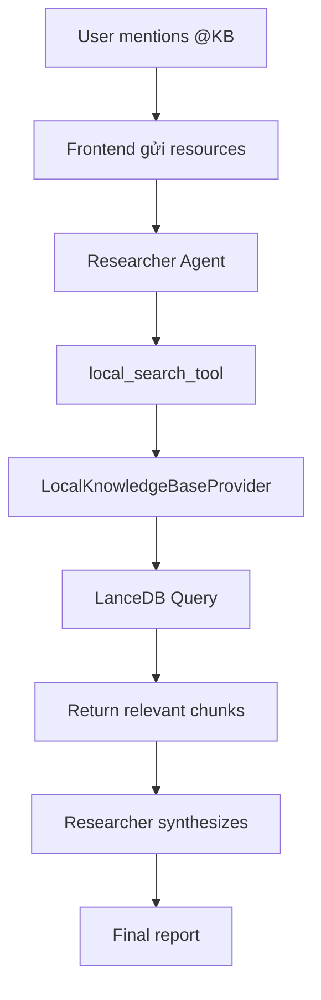

# 📚 Hướng dẫn sử dụng Local Knowledge Base

Hướng dẫn này sẽ giúp bạn thiết lập và sử dụng hệ thống Knowledge Base local thay thế RAGFlow trong DeerFlow.

## 🎯 Tổng quan

DeerFlow đã được cập nhật để hỗ trợ Knowledge Base local với các tính năng:

- ✅ **Local Storage**: Lưu trữ dữ liệu tại thư mục `appdata/` 
- ✅ **LanceDB**: Vector database serverless local
- ✅ **Ollama Embeddings**: Sử dụng embedding models local
- ✅ **Web UI**: Quản lý knowledge bases qua giao diện web
- ✅ **Chat Integration**: Mention knowledge bases trong chat với `@` syntax
- ✅ **Retrieval**: Tìm kiếm semantic trong knowledge bases

## 🚀 Cài đặt nhanh

### 1. Chạy setup script

```bash
# Setup môi trường và dependencies
uv run python setup_local_kb.py
```

### 2. Cài đặt Ollama (nếu chưa có)

```bash
# macOS/Linux
curl -fsSL https://ollama.ai/install.sh | sh

# Windows: Download từ https://ollama.ai/download

# Start Ollama service
ollama serve

# Pull embedding model
ollama pull nomic-embed-text
```

### 3. Test hệ thống

```bash
# Test local knowledge base
uv run python test_local_kb.py
```

### 4. Khởi động servers

```bash
# Backend
uv run python server.py

# Frontend (terminal mới)
cd web
pnpm dev
```

## 📁 Cấu trúc thư mục

```
appdata/
├── knowledge_base_test/           # Knowledge base mẫu
│   ├── metadata.json             # Metadata của KB
│   ├── documents/                # File documents gốc
│   │   ├── file1.pdf
│   │   └── file2.pdf
│   ├── markdown/                 # Markdown converted files
│   │   ├── file1.md
│   │   └── file2.md
│   └── lancedb/                  # Vector database
│       └── documents.lance/
└── demo_knowledge_base/          # KB khác
    ├── metadata.json
    ├── documents/
    ├── markdown/
    └── lancedb/
```

## ⚙️ Cấu hình

### Environment Variables (.env)

```bash
# RAG Provider
RAG_PROVIDER=local_kb

# Local Knowledge Base Settings
LOCAL_KB_MAX_RESULTS=10
EMBEDDING_MODEL=nomic-embed-text

# Search API
SEARCH_API=duckduckgo

# LLM API Keys
OPENAI_API_KEY=your_key_here
ANTHROPIC_API_KEY=your_key_here
```

### Config file (conf.yaml)

```yaml
llm:
  provider: "ollama"  # hoặc openai, anthropic
  model: "llama3.2"   # model cho reasoning
  
agents:
  researcher:
    llm_type: "smart"  # sử dụng LLM mạnh cho research
  coder:
    llm_type: "fast"   # sử dụng LLM nhẹ cho code
```

## 🌐 Sử dụng Web UI

### 1. Quản lý Knowledge Bases

Truy cập: `http://localhost:3000/knowledge-base`

- **Tạo KB mới**: Click "Create Knowledge Base"
- **Upload tài liệu**: Click "Upload Documents" trong KB card
- **Xem documents**: Click "View Documents" 
- **Edit/Delete**: Sử dụng các button trên KB card

### 2. Chat với Knowledge Base

Truy cập: `http://localhost:3000/chat`

#### Mention Knowledge Base:
```
@Knowledge Base Test tell me about statistics
```

#### URI Format:
- `kb://knowledge_base_test` - Toàn bộ knowledge base
- `kb://demo_knowledge_base` - KB khác

## 🔍 Cách hoạt động

### 1. Chat Flow



### 2. Retrieval Process

1. **User Input**: `@Knowledge Base Test explain DMAIC`
2. **Resource Detection**: Frontend detect `@` và convert thành `kb://knowledge_base_test`
3. **Tool Selection**: Researcher agent prioritize `local_search_tool`
4. **Embedding Search**: Query được embed và tìm kiếm trong LanceDB
5. **Result Synthesis**: Kết quả được tổng hợp với web search

## 🛠️ API Endpoints

### Knowledge Base Management

```typescript
GET    /api/knowledge-bases              // List all KBs
POST   /api/knowledge-bases              // Create new KB
PUT    /api/knowledge-bases/{id}         // Update KB
DELETE /api/knowledge-bases/{id}         // Delete KB
GET    /api/knowledge-bases/search       // Search KBs
```

### RAG Resources

```typescript
GET    /api/rag/resources?query=test     // List resources for mention
GET    /api/rag/config                   // Get RAG config
```

### Chat Integration

```typescript
POST   /api/chat/stream                  // Stream chat với resources
```

## 🔧 Troubleshooting

### 1. Ollama Issues

```bash
# Check Ollama status
curl http://localhost:11434/api/tags

# Pull embedding model
ollama pull nomic-embed-text

# Check models
ollama list
```

### 2. LanceDB Issues

```bash
# Check if LanceDB directory exists
ls -la appdata/knowledge_base_test/lancedb/

# Re-index if needed (future feature)
# uv run python reindex_kb.py knowledge_base_test
```

### 3. Empty Search Results

- ✅ Verify knowledge base có documents
- ✅ Check Ollama embedding model 
- ✅ Verify LanceDB data exists
- ✅ Try simpler queries

### 4. Frontend Issues

```bash
# Check API connection
curl http://localhost:8000/api/knowledge-bases

# Restart servers
# Backend: Ctrl+C, then uv run python server.py  
# Frontend: Ctrl+C, then pnpm dev
```

## 🚀 Các tính năng sẽ có

### Đã hoàn thành ✅
- Local knowledge base provider
- Web UI cho management
- Chat integration với mention
- LanceDB vector search
- Ollama embeddings

### Kế hoạch 📋
- Document upload và auto-indexing
- Document deletion
- Knowledge base update/delete
- Advanced search filters
- Multiple embedding models
- Batch document processing

## 💡 Tips & Best Practices

### 1. Embedding Model Selection
```bash
# Lightweight, fast
ollama pull nomic-embed-text

# Better quality, slower  
ollama pull mxbai-embed-large
```

### 2. Query Optimization
- Sử dụng keywords cụ thể thay vì câu hỏi dài
- Thử nhiều cách diễn đạt nếu không có kết quả
- Combine với web search cho thông tin mới nhất

### 3. Knowledge Base Organization
- Tạo KB riêng cho từng chủ đề
- Sử dụng tên và mô tả rõ ràng
- Upload documents liên quan cùng nhau

### 4. Performance
- LanceDB query tốt với <= 1000 documents
- Sử dụng `LOCAL_KB_MAX_RESULTS` để limit kết quả
- Embedding cached sau lần đầu query

## 🤝 Hỗ trợ

Nếu gặp vấn đề:

1. Chạy test script: `uv run python test_local_kb.py`
2. Check logs trong terminal backend
3. Verify cấu hình trong `.env` file
4. Ensure Ollama đang chạy
5. Restart cả backend và frontend

---

🎉 **Chúc bạn sử dụng DeerFlow Local Knowledge Base hiệu quả!** 